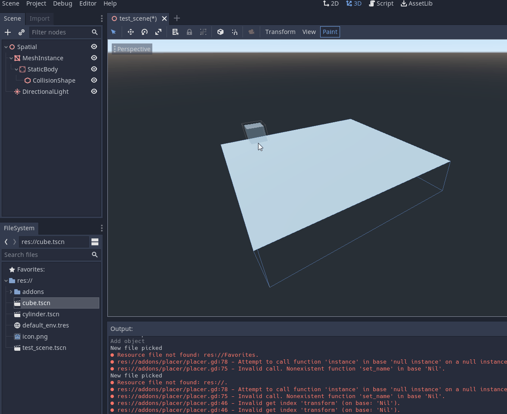

# godotplacer
Editor plugin for speedy placement of objects.

Pick your scene from the FileSystem.

Toggle painting using the "Paint" button in the toolbar above the viewport.

Click to place.

Click, hold and move the mouse to rotate the object. Release to place.

Scroll to resize. Hold shift to zoom the viewport as normal instead.

Undo and redo work.

## Installation

Install to the addons folder of your Godot project.

Enable in Project Settings > Plugins.